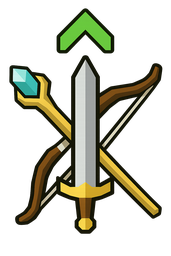
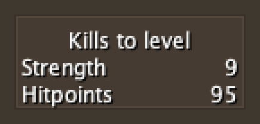
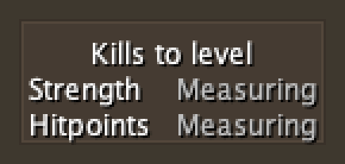
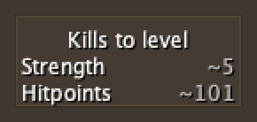
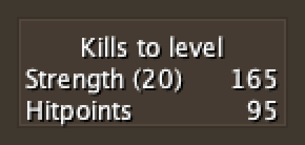
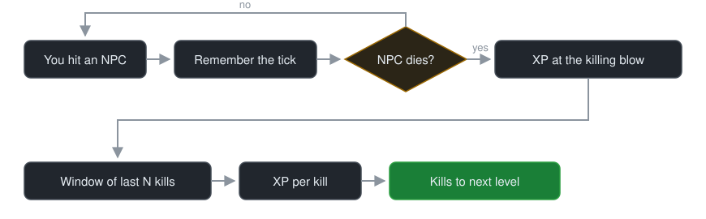

<div align="center">



# Kills to Level

**How many kills until your next combat skill level — measured, not guessed.**

[](https://github.com/neldra/kills-to-level/actions/workflows/build.yml)



</div>

RuneLite plugin that watches how much XP you *actually* earn per kill, then turns it into a
straight answer. No monster database, no formulas to keep up to date, and nothing to configure
before it works.

## Why it measures

Combat XP is paid per point of damage you deal, and how much reaches which skill depends on how
you're fighting:

| Situation | What the game pays |
|---|---|
| Controlled attack style | Splits across Attack, Strength and Defence |
| Longrange | 2 Ranged and 2 Defence per damage |
| Magic | A fixed amount per cast, plus 2 per damage |
| Cannon, thrall, or a partner helping | Their damage removes HP but pays you nothing |
| Overkill on the final hit | Damage past the target's remaining HP earns nothing |

So the XP a kill is worth depends on your style, your setup and who else is hitting it — which is
hard to pin down ahead of time. Measuring avoids the problem entirely: the plugin reads your real
XP at each kill, so whatever you're wearing, casting, or standing next to is already part of the
number, with nothing to keep up to date as the game changes.

## Installation

Requires JDK 11 or newer. The plugin targets Java 11; CI builds and tests on 21.

```bash
git clone https://github.com/neldra/kills-to-level.git
cd kills-to-level
./gradlew build
```

To try it immediately, launch a development client with the plugin already loaded:

```bash
./gradlew run
```

## Usage

Enable **Kills to Level** in the plugin list. Then just fight.

The overlay appears on your first hit and lists the combat skills your attack style is training —
Attack, Strength or Defence for melee, alongside Hitpoints; Controlled shows all three. Change
style and the rows follow on your next hit, so the number on screen always belongs to what you're
training now. The panel clears about 30 seconds after you stop fighting.

A row reads **Measuring** until your second kill gives it something to measure:

<p align="center">
  
</p>

A number is **marked `~` and greyed while it's still being confirmed**:

<p align="center">
  
</p>

Grey never means guessed. Two kills give one real interval of XP, and for a fixed monster that
interval is already exact — so you get a usable answer within a couple of kills rather than
waiting. It turns solid once five kills back it up, and keeps sharpening as you fight.

Every skill counts its own kills, so a skill you've just switched to starts grey even if the one
you left was solid — and picks up where it left off if you switch back.

Switching targets is handled automatically. Move from cows to hill giants and the average
follows you across the next several kills — no reset button, no per-monster setup.

## Configuration

| Setting | Default | What it does |
|---|---|---|
| **Sample window (kills)** | `20` | How many recent kills to average over. |
| **Count to your XP target** | on | Count to the XP target set on the skill tab, not just the next level. |
| **Show Hitpoints** | on | Hitpoints trains on every kill whatever your style, so it's always listed. Turn this off to show only the skill your style is training. |

Raise the window for a steadier number during a long grind; lower it if you switch monsters often
and want the estimate to catch up faster. Adjusting it keeps the kills you've already measured.

### Counting to a target level

Set an XP target on the skill tab in game and the plugin counts to that instead of your next
level, showing the target beside the skill:

<p align="center">
  
</p>

There's no separate goal to configure here on purpose — it reads the target the game already
knows about, so this and your in-game XP target can never disagree. With no target set, or once
you've passed it, it falls back to your next level.

## How it works

<p align="center">
  
</p>


A few details do most of the work:

- **A kill only counts if you earned it.** Damage is credited via RuneLite's own hitsplat
  ownership, so a cannon, a thrall, or another player finishing your target won't create a
  phantom kill.
- **Kills are priced at the killing blow**, not when the corpse vanishes. The corpse lingers
  about six ticks, and at a four-tick attack speed you've usually already hit your next
  target by then — reading XP at despawn would fold that into the wrong kill.
- **A kill only feeds the skills it trained.** Each skill averages its own kills, so an hour of
  Aggressive doesn't drag down the Defence number the moment you switch to Defensive.
- **XP that no amount of your damage could explain is ignored.** Combat XP is paid per point of
  damage, so when a gain far exceeds what your recent hits could pay — a quest reward, an XP
  lamp — it isn't priced as a kill. Your progress still counts it; the per-kill average just
  doesn't get poisoned by it. (On Leagues and Deadman worlds, where XP is multiplied, this check
  stands down.)
- **The window is per-session.** Nothing is written to disk, so a stale average from last
  week can never mislead you today.

## Development

```bash
./gradlew build         # compile + run every test
./gradlew test          # the measurement core only
./gradlew pluginTest    # plugin and overlay tests, against a mocked client
./gradlew overlayShots  # re-render the overlay screenshots in this README
./gradlew run           # dev client with the plugin sideloaded
```

The overlay is rendered headlessly for both the screenshots and the tests, so a visual change can
be checked without logging in. Tests that need a mocking framework live in `src/pluginTest`
rather than `src/test`, because the plugin hub builds `standard` plugins with its own
`build.gradle`, which declares only JUnit.

The measurement core (`KillXpEstimator`) is deliberately free of RuneLite types so it can be
unit tested directly — start there if you're changing how the average behaves.

## Contributing

Issues and pull requests are welcome. If you're reporting a wrong number, the most useful
thing you can include is what you were killing, your attack style, and whether anything else
was damaging your target.

## License

[BSD 2-Clause](LICENSE).
